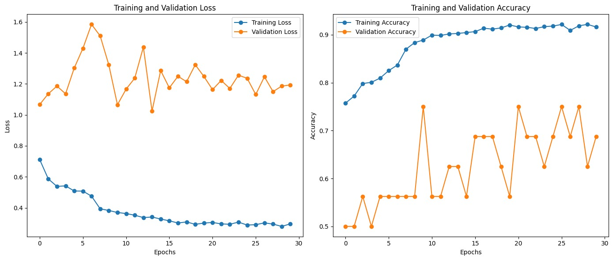
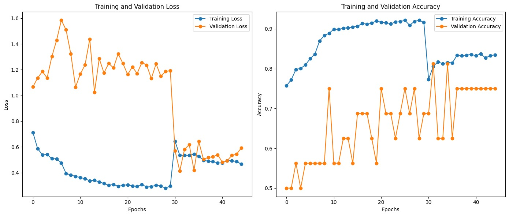
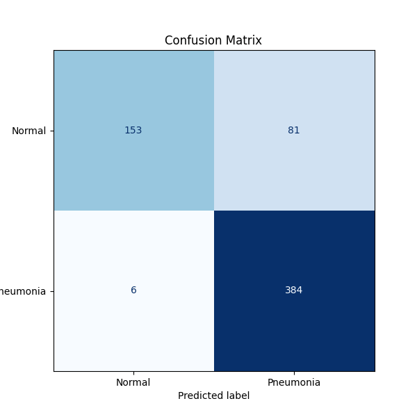

# Deep Learning-based Pneumonia Detection via Chest X-Ray Images
**CAP 5516 - Medical Image Computing**
**Assignment 1**
---
## Project Overview
This project implements deep learning techniques to classify pediatric chest X-ray images into two categories: Pneumonia and Normal. The dataset used for this assignment consists of anterior-posterior chest X-ray images of children aged 1 to 5 years, organized into training, validation, and testing sets. The goal is to achieve high classification accuracy by employing two deep learning approaches using the ResNet-18 architecture.

---
## Subtasks
### Task 1.1: Train the Model from Scratch
- The ResNet-18 model is initialized with random weights.
- Data augmentation and model regularization techniques are applied to improve performance.
- The model is trained for 30 epochs using a batch size of 32 and an initial learning rate of 0.003.

### Task 1.2: Fine-Tune a Pre-Trained Model
- A pre-trained ResNet-18 model (ImageNet-trained) is fine-tuned on the chest X-ray dataset.
- Hyperparameters are optimized for better generalization. 
- Fine-tuning is performed for 15 epochs, using the Adam optimizer with Binary Cross Entropy Loss and a class weight adjustment to account for the imbalanced Pneumonia dataset.

---

## **How to Run the Notebook**
### **1. Start the Notebook Execution**
- Click on the `"Runtime"` menu at the top of the Colab interface and select **"Run all"**.

### **2. Upload `kaggle.json`**
- When prompted, upload your `kaggle.json` file, which contains your Kaggle API keys. This will allow the notebook to download the **Chest X-Ray dataset** from Kaggle. 

     **Note**: If you do not have a Kaggle API key, you can generate one by:
     - Navigating to your [Kaggle Account Settings](https://www.kaggle.com/account).
     - Scrolling down to the **"API"** section and clicking **"Create New API Token"**.
     - This will download the `kaggle.json` file to your computer.

### **3. Automatic Resumption**
- Once the `kaggle.json` file is uploaded, the notebook will **automatically resume execution** and download the dataset.

---

## **Implementation Details**
- **Architecture:** ResNet-18 with a custom binary classification head.
- **Optimizer:** Adam  
- **Learning Rate Scheduler:** StepLR (Step Size = 7, Gamma = 0.1)  
- **Regularization:** Weight Decay = 0.001, Dropout (p=0.5)  
- **Loss Function:** Binary Cross Entropy with Logits  
- **Dataset:** [Chest X-Ray Images (Pneumonia)](https://www.kaggle.com/paultimothymooney/chest-xray-pneumonia)  
- **Augmentation Techniques:** Random cropping, color jitter, affine transformations, normalization.

---

## **Results and Analysis**
### **1. Training and Validation Metrics**
Below are the training and validation loss curves for both models:

| Model | Training Loss (Final) | Validation Loss (Final) | Training Accuracy (Final) | Validation Accuracy (Final) |
|--------|----------------|-----------------|-------------------|--------------------|
| **Model 1 (From Scratch)** | **0.296** | **Unstable, High Variance** | **91.6%** | **68.75%** |
| **Model 2 (Pre-Trained)** | **0.465** | **Increasing Trend, Overfitting at Epoch 7+** | **83.47%** | **75.00%** |

---

#### **Observations:**
- **Model 1:**
   - **Overfitting:** The validation accuracy (68.75%) is significantly lower than the training accuracy (91.6%). A gap this significant (i.e., 22.85%) between training and validation accuracy indicates that Model 1 was most likely memorizing the training data as opposed to learning from features within the data.
- **Model 2:**
   - **Improved Generalization:** The pre-trained model has a smaller training-validation accuracy gap (8.47%) compared to Model 1 (22.85%), indicating better generalization.

**Training and Validation Loss Curves:** 
- Model 1 (From Scratch)   
   
- Model 2 (Pre-Trained)   
  

---

### **2. Confusion Matrix and Classification Performance**
The final classification performance of the fine-tuned model was evaluated using the below confusion matrix.

#### **<u>Pre-Trained Model's Confusion Matrix</u>**

#### **<u>Per Class Classification Accuracy</u>**
| Model | Overall Accuracy | Normal Class Accuracy | Pneumonia Class Accuracy |
|--------|----------------|-----------------|-------------------|
| **Model 1 (From Scratch)** | **89.26%** | **75.64%** | **97.44%** |
| **Model 2 (Pre-Trained)** | **86.06%** | **65.38%** | **98.46%** |
---

#### **Key Findings:**
- **Model 1 achieves a higher overall test accuracy (89.26%)** than the pre-trained model (86.06%), primarily due to better classification of the **Normal** class.
- **Model 2 is better at detecting pneumonia** (98.46% vs. 97.44% in Model 1).
- **False Positive Rate:**  
  - **Model 1:** 153 misclassified normal images.  
  - **Model 2:** 81 misclassified normal images.  
- **False Negative Rate:**  
  - **Model 1:** 6 pneumonia cases misclassified as normal.  
  - **Model 2:** 6 pneumonia cases misclassified as normal.  

---

## **3. Error Analysis and Potential Improvements**
### **Key Failure Cases**
- **False Positives**: Both models struggled with misclassifying normal X-rays as pneumonia due to high intra-class variance in the pneumonia images.  
- **False Negatives**: Model 1 had more difficulty detecting pneumonia cases, likely due to a lack of pre-learned feature extraction.  
- **Overfitting in Model 1**: A large difference between training and validation accuracy suggests that the model fails to generalize to unseen data.  

---

### **Future Improvements**
---
- **Class Imbalance Handling**: Implement **Synthetic Minority Over-sampling Technique (SMOTE)** to artificially balance the dataset.  
- **Hyperparameter Optimization**: Tune learning rate decay, batch size, and dropout rate.  
- **Advanced Data Augmentation**: Increase the range of transformations to enhance robustness.  
- **CAM/Grad-CAM Visualizations**: Further analyze misclassifications using **Class Activation Maps** to identify regions contributing to incorrect predictions.  
---